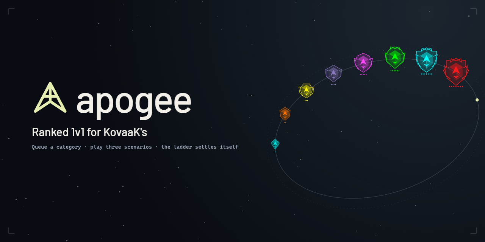

# Apogee



Ranked 1v1 for KovaaK's. Queue for a category, get matched against someone near your
rank, play three scenarios in KovaaK's as normal, and the ladder settles itself. Scores
are read straight from the stats folder, never typed in.

Solo players can open **Expedition** for First Light: six destinations, four different
journeys (checkpoints, route choices, optional preparation, and direct trials), and 122
earnable appearances and trophies. Ordinary training advances accepted challenges. See
[the solo guide](docs/solo-expedition.md) for progression, saved state, and validation.

See [PLAN.md](PLAN.md) for the full design: match format, rating, anti-cheat, and the
phased build.

Before installing, read these. All three are also linked from the bottom of the
client's rail.

- [PRIVACY.md](PRIVACY.md): what is uploaded and what is not.
- [FAIR-PLAY.md](FAIR-PLAY.md): what the anti-cheat catches, what it cannot, and how to
  dispute a voided match.
- [TERMS.md](TERMS.md): what the service asks of you and what it does not promise.

## Status

| Phase | | |
|---|---|---|
| 0 | Scenario taxonomy | done, 1,386 of 1,487 scenarios with aim type and board id |
| 0b | Benchmark data pipeline | done, 128 benchmarks, real thresholds |
| 1 | Stats parser + validation | done, 100% of 12,941 real files, 0 exceptions |
| 2 | History, baselines, ranks, weakness map | done, engine matches KovaaK's exactly |
| 3 | Apogee rank theme + visual editor | done, 8 named tiers |
| 4 | Supabase schema, Steam auth, run upload | done, deployed and verified live |
| 5 | Verification: local integrity + KovaaK's cross-check | done, 0% false positives |
| 6 | Glicko-2, scenario selection, settlement, matchmaking | done, ladder sorts at r=0.998 |
| 7 | Client UI | done, interactive preview on real data |
| 8 | Quests from a pasted evxl link | done, all 128 benchmarks trackable |
| 9 | Electron desktop client | done, boots, watches, renders |
| 10 | Closed beta | gated on population, preflight built |
| 11 | Live sync matchmaking | done, starvation-free, awaiting population |
| 12 | Server-side match engine | done, 11 Edge Functions live; the 3 tournament functions are not deployed yet |
| 13 | Client wired to the backend | done, sign-in + upload + match loop live |
| 14 | First real match | **waiting on a benchmark run** |
| 15 | Apex board, past the top of the ladder | done, deployed |

### Where things stand

The whole loop is built, deployed and verified against the live project: Steam sign-in,
run backfill, run upload, verification, matchmaking, settlement and rating all work end
to end. Eleven thousand real runs have been uploaded and graded, and baselines are
computed from them.

No match has settled yet. Settling one needs a second player, and the queue stays empty
until somebody other than the author plays a category through. The code is written; what
is missing is a population.

## Quick start

```bash
npm install

npm run profile          # your benchmark ranks and weakness map, from local stats
npm run ranks            # the Apogee rank ladder, with self-tests
npm run validate         # every suite against real data
npm run typecheck
```

`npm run profile` takes optional flags:

```bash
npm run profile -- --benchmark voltaic-s5 --difficulty Advanced
npm run profile -- --stats "D:\path\to\FPSAimTrainer\stats"
```

## Rank theme

Apogee's ladder has its own tier names and colours, kept deliberately separate from
Voltaic's. Benchmark rank and ladder standing are different claims and must not share a
vocabulary. Tiers are assigned by population percentile, so a tier keeps its meaning
as the player base grows.

Eight tiers run from Stargazer to Supernova, defined in `data/apogee_ranks.json`.
Nothing in the code keys off the names, so they can be renamed freely.

This is the *rating* ladder. The season's overall standing reuses its eight names, and
each of the six category ladders has sixteen of its own, with no name shared between
them. Both live in `data/seasons/season-1.json` and are edited in the app's Season
editor.

### The colours match the names

Every rank colour is chosen for the thing the rank is called: Arecibo is dish-phosphor
green, Supernova is red, Blunderbuss is old brass and Photon Lance is a blue beam.
Nothing re-derives them from a formula: a ladder people talk about by name should look
like the names.

Open `tools/rank-theme-editor.html` in a browser to edit the palette visually: badges,
ladder distribution, a match card built from real scores, and the promotion moment all
update live. Copy the generated JSON back into `data/apogee_ranks.json`, then run
`npm run ranks` to confirm the bands still tile 0 to 100 with no gap or overlap.

`npm run ranks` also reports, without failing, any colour that would disappear against a
light ground, such as a screenshot or a web page. Some of them do, deliberately. The dark side is
handled at draw time by `legibleOnDark()` in the renderer, which lifts a colour just far
enough to be visible without changing what it is. `npm run docs:ranks` renders every rank
name on both grounds if you want to look.

## Layout

```
data/
  scenario_taxonomy.json     1,487 scenarios, aim types, leaderboard ids, play counts
  evxl_registry.json         128 benchmarks with KovaaK's ids + rank colours
  subskills.json             the eleven sub-skills, derived from what 43 benchmarks
                             call their own scenarios, and the evidence for each
  subcategories.json         the nine Voltaic sub-categories, from Voltaic's sheet
  apogee_ranks.json          Apogee's own rank tiers, names and colours
  score_models.json          learned score = stat * k relations, plus the weapon-block
                             rates that verify runs with no kill rows
  benchmarks/*.json          full definitions: thresholds, ranks, colours
src/core/
  stats/                     KovaaK's CSV parsing
  benchmarks/                energy and rank computation
  history/                   run history and match baselines
  rating/                    Glicko-2
  match/                     scenario selection, settlement, matchmaking, live queue
  verify/                    local integrity checks and KovaaK's cross-check
  quests/                    evxl link resolution and quest generation
  ranks/                     Apogee rank ladder
  consistency/               day-to-day consistency floor and reporting
  sync/                      Steam sign-in and run upload
  report/                    local profile, weakness map, UI snapshot
src/app/                     Electron main, preload bridge, renderer
supabase/                    migrations, seed, edge functions
tools/                       build-time data extraction and preflight
```

## Where the data comes from

Nothing here is guessed or hand-transcribed.

- Scenario metadata and score thresholds come from KovaaK's own public API
  (`webapp-backend/benchmarks/player-progress-rank-benchmark`), which serves the
  official per-scenario `rank_maxes` for every benchmark.
- The benchmark registry (which benchmark maps to which KovaaK's id, plus per-rank
  hex colours) comes from evxl.app's own JSON route, `/data/benchmarks`.
- The eleven sub-skills are derived from the category names the benchmarks themselves
  publish, normalised and counted in `data/subskills.json`. Nine of them are Voltaic's,
  and the derivation reproduces Voltaic's published spreadsheet on all 106 of their
  scenarios, which is the check that makes the same treatment of everybody else's
  believable. Two are named by benchmarks Voltaic's sheet cannot see: Micro Clicking by
  eight of them, Reading Tracking by seven. Every family in `data/pool.json` declares its
  own, and `npm run validate:pool` holds the declaration to the derivation.

All of these are build-time steps. The results are committed to `data/`, so the app never
depends on any of those services being reachable at runtime.

To refresh, run these in order (the taxonomy needs the benchmark definitions, and the
sub-skills need the taxonomy):

```bash
npm run fetch:evxl                              # cached 24h; --force to re-ask
python tools/fetch_benchmark_defs.py            # every benchmark pool.json names
npx tsx tools/fetchTaxonomy.ts                  # aim types, play counts, world records
python tools/fetch_voltaic_subcategories.py     # the check the derivation is held to
npm run build:subskills                         # the eleven, and the evidence for them
python tools/generate_seed.py
```

## Backend

Deployed and verified. See [SETUP.md](SETUP.md) for the full walkthrough.

```bash
npm run validate:schema       # applies migrations + seed to Postgres-in-WASM, no Docker
npm run verify:deployment     # proves RLS, auth and the match engine against the live project
npm run deploy:functions      # redeploy every Edge Function
npm run sync:reference        # push updated reference data (the seed will not)
```

The Edge Functions carry the server side. `steam-auth` is deliberately public because
Steam's servers call it directly; the rest require a session. Verification asserts they
refuse anonymous callers, and that `find-match` and `settle-match` also refuse the anon
key.

The functions import the shared core straight from `src/core`, so settlement, Glicko-2
and the integrity checks are the *same* code the local validation suites exercise, with
no second implementation to drift.

### What is not wired yet

Nothing, on the client side: it signs in over Steam, backfills its run history, and
calls `find-match`, `submit-run` and `settle-match` for real. The missing piece is an
opponent, as described under Status.

`validate:schema` is the useful one during development: it runs the whole migration and
seed against a real Postgres compiled to WASM, so schema errors surface without Docker,
a cloud project, or network access.

### The security rule everything rests on

The client never computes anything that matters. It parses CSVs, hashes them, and
uploads facts. Baselines, deltas, verification tiers and ratings are all computed
server-side. RLS enforces it: clients hold no write grant whatsoever on `ratings`,
`matches`, `match_sides`, `baselines` or `verified_pbs`. Runs are insert-and-read only,
never update or delete, so history is append-only and a bad run cannot be quietly
removed after the fact.

`runs.csv_sha256` is unique per player, which gives idempotent backfill and replay
protection from the same constraint: re-running a sync is a no-op, and a good run
cannot be submitted twice to win two matches.

### Steam sign-in

Supabase has no native Steam provider and cannot have one, because Steam speaks OpenID
2.0 rather than OAuth2/OIDC. `supabase/functions/steam-auth` bridges the gap: it runs
the OpenID dance, verifies the assertion with Steam directly, and mints a Supabase
session for the resulting SteamID64.

The desktop side uses the RFC 8252 native-app loopback pattern. The app listens on an
ephemeral `127.0.0.1` port, the browser handles login, and a single-use token (never
a session) crosses back over loopback to be redeemed.

This is load-bearing: the SteamID is the join key to KovaaK's leaderboards, so without a
trustworthy Steam binding, score verification is meaningless and the ladder is
unprotected.

### Why two scenario tables

A scenario belongs to many benchmarks with *different* thresholds. Voltaic S5.5 reuses
S5's Advanced scenario names but re-tunes the ranks. Identity lives in `scenarios`;
thresholds live in `benchmark_scenarios`, keyed by (benchmark, difficulty, scenario).
Collapsing these silently gives a scenario whichever benchmark's numbers loaded last.

## Verification

Two independent layers (`src/core/verify/`).

Local integrity. The file must be internally coherent. Every check was measured
against all 11,058 real runs before being allowed to reject anything, and **every hard
check has a 0.00% false-positive rate**. Three checks in the first draft did not, and
were corrected rather than kept:

- rejecting sub-20ms TTK flagged 62% of genuine runs, because KovaaK's TTK is
  first-hit-to-kill within a burst, not reaction time
- rejecting negative scores flagged real pressure-scenario runs, which legitimately
  score below zero
- requiring one kill row per kill flagged 0.85%, because `Kill #` is a running counter:
  penalty rows repeat it and multi-kills skip it

Score models are the strongest check, and were discovered rather than designed.
Most scenarios score as a fixed multiple of a countable stat (`Frogtagon = kills * 10`,
`Aether = hitCount * 1`), so the score can be re-derived from the run's own counters.
221 scenarios have a model, covering 9,576 of 11,896 real runs (80.5%), and a +1% score
edit is caught. Scenarios with no model skip the check rather than failing it.

```bash
npm run build:score-models    # rebuild data/score_models.json from your corpus
npm run validate:verify       # false positives, tamper detection
```

KovaaK's cross-check. `user/scenario/last-scores/by-name` returns a player's ~10
most recent runs with `hash`, `epoch` and `challengeStart`, so a match run is verifiable
whether or not it was a personal best. The KovaaK's username is confirmed against
`user/search` to belong to the signed-in SteamID before it is stored, and RLS forbids
clients from writing it.

Tiers: `verified` → `consistent` → `suspect` → `rejected`. Only an incoherent file is
rejected outright. Suspect still counts. Measured, ~1 in 9 genuine personal bests
never reach KovaaK's servers, so "above your PB with no server record" means *look
closer*, not *forged*.

## Rating and matches

Glicko-2, implemented from the specification and checked against Glickman's own
worked example: 1464.0506 / 151.5165 / 0.059996, matched exactly. Chosen over Elo
because Apogee's play is sparse, bursty and asynchronous, which is the case Elo handles
worst.

A simulated 60-player, 25-period season recovers the hidden true-skill order at a
Spearman correlation of 0.998, so the ladder does sort people by skill rather than
by luck.

Match format. Three scenarios from a category, each scored as a delta against the
player's own baseline, averaged; higher average wins. Scenario choice is a pure function
of the match seed, so both sides get the same three and no client can reroll them.

Because it is normalised, you can score higher and still lose. That is intended, and
`explainVerdict()` names the case explicitly rather than leaving the player to conclude
the app is broken.

Matchmaking is asynchronous: you are matched against a stored run set from someone
near your rating. It works with one player online, which is what makes launch survivable
(PLAN.md §6). Live mode reuses all of it and adds only a queue and a countdown.

### Duels

A match aimed at one named player instead of at the pool. Pick somebody off the roster,
play your three scenarios, and it sits in their inbox for seven days; accepting builds
an ordinary contested match against the side you left behind. Nothing about settlement,
rating or verification is different: a duel is the seeding match that already existed,
with a name attached, and the ladder cannot
tell the two apart afterwards.

The other player cannot see your score until they answer. It is never copied onto the
duel, so accepting is a decision made blind; being able to read it first would be
cherry-picking, which the queue also refuses in the other direction.

If they never answer, the session still counts. Your three runs settle as a seeding
match regardless and go into the pool, where the ordinary queue can draw them.

The friends list beside the picker is a one-sided shortlist. Adding somebody tells them
nothing and decides nothing; it just puts them at the top of your own list.

### The baseline, corrected by measurement

The baseline is the centre every match is measured from. The first implementation used
the mean of the top 30% of recent runs, for sandbag resistance. Measured across 156
scenarios of real history, it was badly off-centre: only 26% of genuine runs landed
above their own baseline, so matches were decided by who avoided a disaster rather than
who played well.

| definition | mean delta | above baseline | sandbag drop |
|---|---|---|---|
| top 30% | −3.8% | 26% | 3.0% |
| **median** | **+0.4%** | **58%** | **3.5%** |
| plain mean | +0.6% | 60% | 9.3% |

The verified-PB floor turned out to be what defeats sandbagging, not the high-water
statistic. With the floor in place a median is centred *and* nearly as hard to game,
while a plain mean is three times more gameable. So:

```
baseline = max( median(last 50 runs), 0.9 × verified PB )
```

```bash
npm run compare:baselines    # reproduce the table above on your own history
```

## Quests

Quests are generated against whichever benchmark the player tracks. Paste any evxl
link. All 128 benchmarks in the registry are trackable, resolved entirely
offline from committed data.

Resolution refuses to guess: an ambiguous name (`"Voltaic"` matches S3, S4, S5, S5.5)
resolves to nothing rather than silently tracking the wrong season.

## Practice: the season without the queue

The season is a benchmark, and grinding it should not require an opponent. The Season
screen shows the pool one difficulty at a time, the way every benchmark it is drawn
from is played, grouped by category and sub-skill and no further, with your personal
best, the score the next rank wants, and a **Play** button that deep-links straight into
KovaaK's. Rows your next rank is actually scored on are highlighted, and the screen opens
on the band holding the most of them.

Which family a scenario belongs to is how the ladder grades it (§14) and is deliberately
not shown: `Reactive Tracking` is one list, not two called `Ground Plaza` and
`Air CELESTIAL`.

### You are grinding other benchmarks at the same time

Nothing in the pool was invented. Every family was picked out of the corpus the community
already grades itself against, and 227 of the 252 scenarios appear in at least one of the
43 benchmarks under `data/benchmarks/`, 71 of them in two or more. Viscose S2 shares 55 of
them and Viscose 37; thirty-eight benchmarks in total. Voltaic's own seasons are a small
part of it (16 scenarios from S5, 12 from S5.5, 7 from S4, and the core circuits account
for 17 of those), so an evening on this ladder is mostly scenarios a Voltaic grinder isn't
already playing.

So each row carries a mark per benchmark that names it, in that benchmark's own colour,
filled in once your score holds a rank there. `voxTargetSwitch 2` is one scenario and
five ladders: Aimerz+ SpeedTS Easy and Hard, Viscose Medium, Viscose S2 Medium and
AimSpeed 2.0 Normal.

The rank is always per *scenario*, never per benchmark. Every benchmark file publishes
score thresholds for the scenarios it names, so "this score is Cerulean in Viscose" is read
straight off the author's own table. "Your Viscose rank is Cerulean" is not: the pool takes
some of a benchmark's scenarios and not all of them, and a figure computed from a partial
sheet would be wrong in the flattering direction. A benchmark's overall rank belongs to the
benchmark.

How far through its *current* rank step a score is fills the row itself, measured from
the threshold already cleared rather than from zero. Measured from zero, everything you
have touched reads as nearly full and the fill says nothing. Filling the row rather than
a bar inside it means a band of thirty-nine is one ragged edge to scan down instead of
thirty-nine gauges to read one at a time.

For a whole session at one difficulty there are twenty-eight KovaaK's playlists: each of
the six categories at each of the four bands, plus one of everything at each band. They
install from the same screen, one at a time or all twenty-eight, straight into KovaaK's own
Playlists folder.

```
Apogee Static Clicking     9      Apogee Speed Switching      6
Apogee Dynamic Clicking    6      Apogee Evasive Switching    6
Apogee Precise Tracking    6      Apogee All                 39
Apogee Reactive Tracking   6
```

Each of those is four playlists, one per band, ending `Novice`, `Intermediate`, `Advanced`
or `Expert`. A category's count is its families, because a band takes one variant of each.

KovaaK's reads playlists at startup, so the app says so rather than leaving anyone hunting
a menu for a file that is genuinely on disk. The names never begin `Apogee Match`, which
is the prefix the client sweeps between matches; a practice playlist deleted mid-session
would look exactly like the app losing your things.

```bash
npm run practice              # the same list, in the terminal (--all for every band)
npx tsx tools/buildPlaylists.ts --install   # the playlists, without opening the app
```

None of it queues, uploads or settles anything. Runs still land in the stats folder and
still count toward baselines, so an evening of practice is not an evening off the ladder.

## Desktop client

```bash
npm start      # build and launch
npm run dev    # the same, but rebuilt and relaunched on every save
npm run smoke  # boot, verify, exit; no window, usable in CI
npm run doctor # why is it not working: bundle, folder, keys, data
```

`npm run dev` exists because Electron holds a single-instance lock: `npm start` with a
window already open focuses the old process, which is still running the old bundle, so
a change that is definitely on disk is definitely not in the app. The dev loop rebuilds
and relaunches on save, and the window reopens where it was.

The stats folder is found from Steam's own `libraryfolders.vdf`, so an install on any
drive or library is picked up without being told; a folder chosen by hand is remembered,
along with the window's size and position.

Electron main process finds the KovaaK's stats folder, watches it, and rebuilds the
player snapshot whenever a run lands. All parsing and computation happens in main;
the renderer is a pure view that receives settled data over a narrow, named IPC bridge.
That mirrors the server-side rule: the layer that can be tampered with is never the
layer that decides anything.

The renderer runs with a CSP, context isolation on, and no Node access. Its preload
exposes 67 named methods and no generic "invoke any channel" escape hatch.

The file watcher waits for a file's size to stop changing before parsing. KovaaK's
writes stat files progressively, so parsing on the first filesystem event yields a
truncated CSV with no `Score:` line.

`npm run ui` regenerates `tools/apogee-ui-preview.html`, a shareable single-file build of
the same renderer with a snapshot inlined, so the preview and the app cannot drift.

## Live matchmaking

Async carries the ladder from day one; `liveQueue.ts` switches on once there is a
concurrent population. Everything downstream is unchanged: same seeded scenarios, same
settlement, same rating update.

The problem live mode has that async does not is starvation. A player at the top or
bottom of the ladder may have nobody close. Tolerance therefore widens with waiting
time, and a player who still cannot be paired is released to an async match rather than
force-paired into a pointless one. Simulated across four populations (100 players, 8
players widely spread, a lone outlier among 20 clustered, and an odd population),
nobody is ever stranded.

## Before inviting anyone

```bash
npm run beta
```

Checks what must be true before a closed beta: thresholds populated, RLS on every
table, no client write policy on `ratings`/`matches`/`baselines`, Steam assertions
actually verified, renderer locked down, environment configured. Separates blockers
from advisories, and prints the manual items it cannot check rather than pretending
they're done.

## The energy model

Reverse-engineered from KovaaK's API and validated against real accounts. Computed
category and overall progress match the server to within 0.005 energy, and every rank
matches, across 24 checks (`npm run validate:engine`).

- Each scenario threshold `i` is worth `2500 * (i + 1)` energy; between thresholds
  energy interpolates linearly, below the first it scales from zero, above the last it
  caps.
- Category energy is the sum of its scenarios'.
- Category and overall rank are the highest thresholds met.

Per-scenario energy is on a universal scale, but category thresholds differ: Switching
requires more energy for the same rank than Clicking, which is easy to get backwards.

## Credits

Apogee is built on work other people published, and it would not exist without it.

The benchmark authors. Season 1's pool is 252 scenarios, 227 of them named by at least
one of thirty-eight published benchmarks, and every one of those is somebody's design
work. Deciding which scenario measures which sub-skill, and at what difficulty, is the
hard part, and it was already done. Each links to its own published sheet, which is the
source Apogee reads rather than a hand-copied version of it. The counts overlap, because
a scenario several benchmarks name is credited to all of them:

- [Viscose Benchmarks S2](https://docs.google.com/spreadsheets/d/1WeuEk444WOkTpvOGMYiertxwlI9gRQSapYiwxjFbT08) (55 scenarios)
- [Viscose Benchmarks](https://docs.google.com/spreadsheets/d/1bFAlt6g_Gm8P9RBkcAoObpbIGFwVS5gXIdIK9B_YyZE) (37 scenarios)
- [TSK Mixed Benchmarks](https://docs.google.com/spreadsheets/d/1QlmPnGcQ9joO49Fx3wVmEGyYIWzEGlPgDdpfAulAu-E) (20 scenarios)
- [snakbox Benchmark](https://evxl.app/benchmarks/snakbox%20Benchmark) (19 scenarios)
- [Voltaic S5](https://docs.google.com/spreadsheets/d/1RjVJi9AdWLXIOkKR8z6mhmRo_SNokJPxKtLXHWk12Z4) (16 scenarios)
- [Aimerz+ S1](https://docs.google.com/spreadsheets/d/1z-XwvdEXZ7rip2ZJ9aVff0-YqrnX6Yluf89f9LBbroc),
  [AimSpeed Benchmarks 2.0](https://evxl.app/benchmarks/AimSpeed%20Benchmarks%202.0) and
  [Revosect S1](https://docs.google.com/spreadsheets/d/1MQujX14dooQWcHu4mvvP5fetHVIr7Apg1taR96hSho0) (13 scenarios each)
- [Revosect S5](https://docs.google.com/spreadsheets/d/1aHN2bdUehBtmx5COqsMT1q8SN_JImQYUfsSN73uQyEE) and
  [Voltaic S5.5](https://docs.google.com/spreadsheets/d/1kiS9CvXTQjLsm42nBafhddu2Q7XdWtxaMtumeZ_sV-c) (12 scenarios each)
- [Lemon Static Benchmark](https://docs.google.com/spreadsheets/d/1V9lt5BjKLpzoKBPd-4WgStzhKv-javTWaNcISaLJERg) (11 scenarios)
- [Astro Tracking Benchmark](https://docs.google.com/spreadsheets/d/1KXrXJpCl8xnoa3JuFcthE306Q9R9MOAJWhXj_xXzLOQ) (10 scenarios)
- [Aimerz+ Evasive Switching](https://docs.google.com/spreadsheets/d/1kxI184tdhT55k98gsfCHy_CRBznu84aaJP8PAJg6-dU) (8 scenarios)
- [Aimerz+ S0](https://evxl.app/benchmarks/Aimerz%2B%20S0),
  [Viscose Entry Benchmarks](https://docs.google.com/spreadsheets/d/1wMKCKhFQDwGvFgo9KvfbpNYzJ05XQ8gnyXjxNOhdCww) and
  [Voltaic S4](https://docs.google.com/spreadsheets/d/1qUzF2KHcfs_FgsaDFRfGsLgHhoC1Md5bzMOUbsYzSjg) (7 scenarios each)
- [Aimerz+ Dynamic Clicking](https://docs.google.com/spreadsheets/d/1HGXrHC-3aMi0F0bmfN7rZE6j2oLGJsvGn3r6uKDrp70),
  [Jade Palace Air](https://docs.google.com/spreadsheets/d/11-E1KWTCw27s6fhW4nwB0F_2ckbdv5RDcBiseUcm1E4) and
  [Jade Palace Ground](https://docs.google.com/spreadsheets/d/131tMwNmJY-lJPVdddpOWKY9uajDWWe3I5ym-UzmF0QE) (6 scenarios each)
- [Aimerz+ SpeedTS](https://docs.google.com/spreadsheets/d/1-9-RQ5-a78HF49eMsYcf7PjBkpbgIahpBwTLYSu9RK4),
  [Community Benchmarks](https://docs.google.com/spreadsheets/d/1X43zejitcxnCwN6DJmInrouG4m-eNup8sBqCOdk93eg) and
  [Sparky (Voltaic) S1](https://evxl.app/benchmarks/Sparky%20%28Voltaic%29%20S1) (5 scenarios each)
- [Aimerz+ Static Clicking](https://docs.google.com/spreadsheets/d/1rvrijNj9JY4WHhrWrojtk_Q2hvsFzO2-laUsPHxOMSs) and
  [SuperbAim S2](https://docs.google.com/spreadsheets/d/1u3aMTs-jM1zvXdsjtXh5hWSGnANJG7nUWCidQyvWQw4) (4 scenarios each)
- [Aimerz+ Precise Tracking](https://docs.google.com/spreadsheets/d/1czvuvgks1SoMNUH_aevVPm5lOgqCQHa_UVR8izpUxfg),
  [Aimerz+ Reactive Tracking](https://docs.google.com/spreadsheets/d/15VloIkv-V-B3oq4JTbSnIKwsPMwccx2sQEwTohqlprw) and
  [AimSpeed Benchmarks](https://docs.google.com/spreadsheets/d/1V3UE_NltXh8YL0gYueJ6jarVZy8lxH7xcYT9K_9Z-Jo) (3 scenarios each)
- [Anima Micro v2](https://evxl.app/benchmarks/Anima%20Micro%20v2),
  [Avasive S2](https://docs.google.com/spreadsheets/d/1yF2M1j_FSN5MXz-TdxEnvsdNZ_nFZhGDSBrygWFJdDE),
  [cA Static S1](https://docs.google.com/spreadsheets/d/18YMQQZs7qy2xKxCEwHkTG4DeQTuEr0Z05cmAIvuuieE),
  [e1se Smooth Benchmark](https://docs.google.com/spreadsheets/d/1IXyjASZHs8yaVgS_os0wMLuvHIdZ2L8wrah_ShjXQ7w),
  [Jade Palace Dynamic](https://docs.google.com/spreadsheets/d/1W_RYk3_xbvsS4BHnTItgkwWIoEVh-dbAWDhAWUyvnZU) and
  [PureG S1](https://evxl.app/benchmarks/PureG%20S1) (2 scenarios each)
- [Anima Micro v1](https://docs.google.com/spreadsheets/d/1H8WPvDyOGtSb9f-lNocNxULRDhptG5PlE2mcpyxnaSY),
  [e1se Tracking Routine](https://evxl.app/benchmarks/e1se%20Tracking%20Routine),
  [PureG S2](https://evxl.app/benchmarks/PureG%20S2),
  [Voltaic S3](https://docs.google.com/spreadsheets/d/1yHj87rQNW2WsuH24UoKZajNwNpI6CVyUjR3AwBMbnnY) and
  [wobin S1](https://docs.google.com/spreadsheets/d/1XhuTL78YAP4KIR7LfE6w66efKIvICGGmET6wU8zg5fE) (1 scenario each)

Forty-three benchmarks are read in total, not thirty-eight. The other five name nothing
in the pool, but they are part of what `data/subskills.json` is derived from: eleven
sub-skills, and for each one a count of how many independent authors name it. A
benchmark that classifies its own scenarios is doing work Apogee would otherwise have to
guess at, and guessing at it was measurably wrong.

The counts are the benchmark marks the practice list puts on each scenario
(`originsOf` in `src/core/season/practice.ts`), so they can be re-derived whenever the
pool changes.

Every threshold in the season records where it came from, and
`npm run validate:thresholds` counts them: 143 are cut from the scenario's own KovaaK's
leaderboard, 9 are adopted verbatim from a benchmark that publishes that scenario at that
difficulty, and 4 are set by hand where the board is too thin for a percentile cut. An
earlier hand-derived sub-category mapping turned out to be wrong on 6 of 18 scenarios,
which is the argument for reading the source and deriving the rest.

Apogee's rank names are its own. The rating ladder and the season's overall standing
share the eight names from Stargazer to Supernova, and each of the six category ladders
has sixteen of its own. None of them is any benchmark's, so a rank here can never be
mistaken for a Voltaic or Revosect rank in either direction.

[KovaaK's](https://store.steampowered.com/app/824270/) (The Meta) is the game. Every
score Apogee reads was produced by KovaaK's, and its servers are what make verification
possible at all. They are the referee; Apogee reads their record and claims no authority
of its own, and every match is played in KovaaK's itself.

[evxl.app](https://evxl.app) is the benchmark registry, read from the route it
publishes, which is what makes 128 benchmarks trackable instead of one hard-coded list.

Scenario and playlist authors, whose scenarios are the actual content of every match.

None of the above endorse Apogee or are responsible for it.

## Licence

GNU Affero General Public License, version 3 or later (AGPL-3.0-or-later). The full
text is in `LICENSE`.

Forking it and running your own ladder is allowed. The condition that matters here is
the Affero one: Apogee is a desktop client in front of a hosted backend, and a plain GPL
would let someone run a modified server for other people without ever publishing what
they changed. Section 13 closes that. If you operate a modified Apogee as a service,
the people using it are entitled to your source.

Two things the licence does not cover, because they are not this project's to give:
the benchmark thresholds under `data/` are derived from work by the benchmark authors
credited above, and the scenarios themselves belong to their authors and to KovaaK's.
